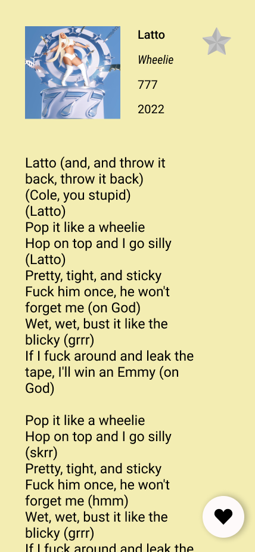

    <h1><b>MyGenius App</b></h1>
    <h4>
        <a href="#about-the-project">About the project</a>
        •
        <a href="#visuals">Visuals</a>
        •
        <a href="#built-with">Built with</a>
        •
        <a href="#credits">Credits</a>
    </h4>

## Table of contents

- [About the project](#about-the-project)
- [Visuals](#visuals)
- [Built with](#built-with)
- [Credits](#credits)

## About the project

 
  MyGenius app is a training project built during my final degree year. It's a lyrics app based on the Genius website interface, using an external lyrics API.

## Visuals

 
    
    
    
    

## Built with

## Credits

Diane M.

